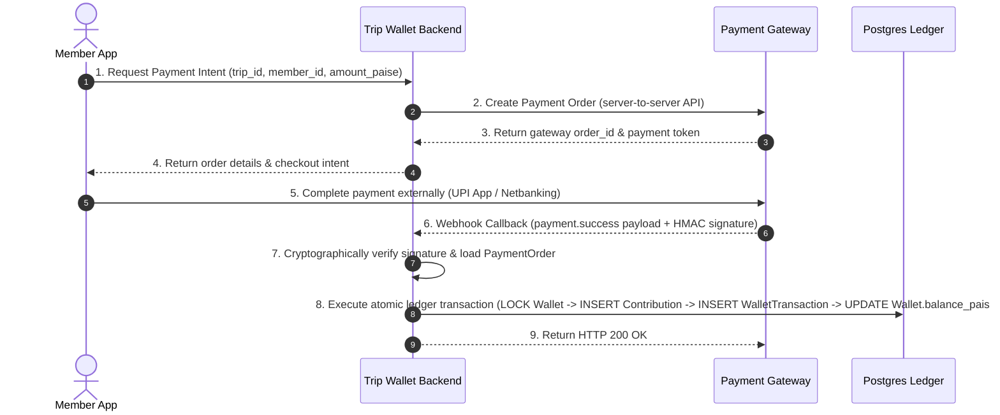

# Trip Wallet — Payment Integration Architecture Plan
## Phase 3+ Future Implementation Guide (Strictly Architectural & Non-Code)

> **IMPORTANT:**
> Payment integration is **NOT** implemented in Phase 2.9.
> This document specifies the architectural blueprint, security mandates, and ledger separation principles required when implementing real payments (UPI, Razorpay, Cashfree, etc.) in subsequent phases.
> No payment provider SDKs, webhook listeners, or client-side payment logic should be added until explicitly directed.

---

## 1. Overview & Separation of Concerns

The central invariant of Trip Wallet is that **payment processing** and the **financial ledger** are completely decoupled domains:

```
┌─────────────────────────┐
│     Payment Gateway     │  (External lifecycle: PENDING, ATTEMPTED, SUCCESS, FAILED)
│  (Razorpay / Cashfree)  │
└───────────┬─────────────┘
            │ Verified Server-Side Webhook / Signature
            ▼
┌─────────────────────────┐
│ Payment Orders (Future) │  (Tracks gateway order_id, payment_id, external status)
└───────────┬─────────────┘
            │ On Verification ONLY (Once and Only Once)
            ▼
┌─────────────────────────┐
│   Trip Wallet Ledger    │  (Authoritative internal balance: Contributions,
│ (PostgreSQL with Locks) │   Expenses, Splits, Adjustments — All Integer Paise)
└─────────────────────────┘
```

### Key Separation Rules:
1. **Never conflate payment order state with ledger balance:** A created payment order or intent does NOT modify wallet balance or ledger transactions.
2. **Payment gateway records are ephemeral attempts; ledger transactions are immutable facts:** Multiple payment attempts may fail or expire; only a cryptographically verified successful payment triggers a ledger `CONTRIBUTION`.
3. **Integer paise everywhere:** Both the payment gateway payloads and the internal ledger must strictly use integer paise (₹1 = 100 paise). Floating-point amounts are strictly prohibited.

---

## 2. Future Payment Architecture & Flow

The standard 8-step lifecycle for wallet funding via payment gateways:



---

## 3. Provider Abstraction Pattern

To avoid vendor lock-in with a single gateway (e.g., Razorpay vs. Cashfree vs. PhonePe vs. PayU), the future backend implementation should introduce a provider-agnostic interface:

```python
# Conceptual architecture only (do not implement now)
class PaymentProvider(ABC):
    @abstractmethod
    async def create_order(self, amount_paise: int, currency: str, receipt: str, notes: dict) -> ProviderOrderResponse:
        pass

    @abstractmethod
    def verify_webhook_signature(self, raw_body: bytes, signature_header: str, secret: str) -> bool:
        pass

    @abstractmethod
    async def fetch_payment_status(self, payment_id: str) -> ProviderPaymentStatus:
        pass

    @abstractmethod
    async def process_refund(self, payment_id: str, amount_paise: int, reason: str) -> ProviderRefundResponse:
        pass
```

Each specific gateway (e.g., `RazorpayProvider`, `CashfreeProvider`) implements this interface. The application business logic communicates exclusively through `PaymentService`, which depends only on `PaymentProvider`.

---

## 4. Webhook Security & Verification Mandates

Webhooks are the primary vector for asynchronous confirmation. They must satisfy strict security controls:

1. **Cryptographic HMAC Signature Verification:**
   - Every incoming webhook must be validated using the provider's official signature algorithm (e.g., HMAC-SHA256 of the raw request payload computed against the server-side webhook secret).
   - Replay attacks must be mitigated by verifying timestamps within acceptable clock skew tolerances (e.g., ≤ 5 minutes).
2. **No Trust in Client-Reported Success:**
   - The mobile client must NEVER directly confirm a payment to credit the wallet.
   - Client callbacks or redirects are treated only as UI cues to poll/refresh server state.
3. **Webhook Idempotency:**
   - Payment gateways retry webhooks upon network timeouts or non-200 responses.
   - The webhook handler must record incoming `webhook_event_id` or `gateway_payment_id` inside an idempotent event table.
   - If an event has already been processed, return `HTTP 200 OK` immediately without mutating the ledger.

---

## 5. Ledger Integration & Row-Level Locking

When a payment is successfully verified:

1. **Transactional Boundary:**
   - All DB operations must execute in a single database transaction.
2. **Row-Level Locking:**
   ```sql
   SELECT * FROM wallets WHERE trip_id = :trip_id FOR UPDATE;
   ```
   This prevents race conditions with concurrent expenses or contribution adjustments.
3. **Ledger Records Created:**
   - A `Contribution` record with `payment_method='ONLINE'`, status `CONFIRMED`, and external reference linking to the payment order.
   - A `WalletTransaction` record with `transaction_type='CONTRIBUTION'`, exact `amount_paise`, and `reference_id=contribution.id`.
   - Update `Wallet.balance_paise += amount_paise`.
4. **Idempotency Keying:**
   - Use the gateway's unique transaction identifier (e.g., `razorpay_payment_id`) as the internal `idempotency_key` or `request_hash` to ensure it can never be credited twice.

---

## 6. Daily Reconciliation & Anomaly Detection

In production, automated reconciliation jobs are critical:

1. **Automated Cron Sync:**
   - A scheduled background task (e.g., daily at midnight) queries the payment provider for all settled transactions in the last 24 hours.
   - Compares the provider's settlement batch with internal `PaymentOrder` and `Contribution` records.
2. **Mismatch Handling:**
   - **Payment Succeeded at Gateway but Missing in Ledger:** Auto-reconcile by recording the missing contribution with note `RECONCILED_AUTOMATIC`.
   - **Payment Failed at Gateway but Credited in Ledger:** Immediate critical alert flagged to administrators; lock trip settlement until audited.
   - **Paise Discrepancy:** Immediate critical alert flagged; never auto-adjust without manual administrator approval.

---

## 7. Failure Handling & Refunds

1. **Dropped Webhooks / Network Timeouts:**
   - If the webhook is delayed or dropped, the client or a periodic backend job can trigger a server-to-server payment inquiry:
     `GET /payments/{order_id}/verify`
   - Backend directly queries gateway status endpoint, verifies success, and completes ledger credit.
2. **Expired Orders:**
   - Payment orders should have an expiration TTL (e.g., 30 minutes). Orders remaining in `CREATED` state past TTL are transitioned to `EXPIRED`.
3. **Refunds upon Trip Cancellation:**
   - If a trip is cancelled or an over-contribution occurs, refunds must use the gateway's refund API.
   - A compensating `WalletTransaction` of type `CONTRIBUTION_ADJUSTMENT` (negative amount) or `REFUND` must be recorded.

---

## 8. Security & Secret Management Mandates

1. **Never Store Payment Credentials:**
   - Absolutely no UPI PINs, card numbers, CVVs, netbanking passwords, or OTPs should ever touch Trip Wallet servers, logs, or databases.
   - All sensitive payment credentials are submitted directly to the PCI-DSS compliant payment gateway hosted fields or SDKs.
2. **Server-Side Credentials Only:**
   - Gateway API keys, API secrets, and webhook secrets MUST reside exclusively in backend environment variables (`RAZORPAY_KEY_ID`, `RAZORPAY_KEY_SECRET`, `RAZORPAY_WEBHOOK_SECRET`).
   - Mobile and web clients receive only the public `key_id` and short-lived `order_id`. Secrets must never be packaged into mobile APKs, Flutter assets, or web bundles.
3. **Masked Metadata in Logs:**
   - Payment-related logs must mask bank accounts, UPI VPA handles, and customer phone numbers in compliance with privacy and data protection standards.

---

## 9. Implemented Razorpay Test Mode Setup & Production Architecture

The Trip Wallet payment pipeline is now fully implemented, verified, and hardened for Razorpay Test Mode and production.

### Deployment & Configuration
- **Backend URL:** `https://trip-wallet-api.onrender.com`
- **Webhook Endpoint:** `https://trip-wallet-api.onrender.com/payments/webhook`
- **Environment Variables (Backend & Render):**
  - `RAZORPAY_KEY_ID`: Razorpay Test / Live Key ID (e.g. `rzp_test_...`)
  - `RAZORPAY_KEY_SECRET`: Razorpay Secret Key (kept exclusively on server, never sent to clients)
  - `RAZORPAY_WEBHOOK_SECRET`: Secret configured in Razorpay Dashboard for HMAC-SHA256 signature verification

### Razorpay Dashboard Webhook Configuration
1. Log in to the [Razorpay Dashboard](https://dashboard.razorpay.com/) (Test Mode).
2. Navigate to **Settings** > **Webhooks** > **Add New Webhook**.
3. **Webhook URL:** `https://trip-wallet-api.onrender.com/payments/webhook`
4. **Secret:** Set to the exact value of `RAZORPAY_WEBHOOK_SECRET`.
5. **Active Events:**
   - `payment.captured`
   - `payment.failed`

### Dual Settlement & Deduplication Architecture
The backend supports two complementary channels for final settlement:
1. **Client-Driven Synchronous Verification (`POST /trips/{trip_id}/payments/verify`):**
   - Flutter passes `razorpay_payment_id`, `razorpay_order_id`, and `razorpay_signature`.
   - Backend verifies HMAC-SHA256 signature and fetches authoritative payment details from Razorpay API.
   - Idempotently marks Payment `SUCCESS`, creates `Contribution`, and updates `Wallet.balance_paise`.
2. **Asynchronous Webhook Processing (`POST /payments/webhook`):**
   - Validates raw body HMAC-SHA256 signature using `X-Razorpay-Signature`.
   - Persistent deduplication via table `payment_webhook_events` (`event_id` indexed uniquely).
   - If webhook arrives after client verification, returns `{"status": "already_processed"}` without double-crediting.
   - If webhook arrives before client verification (or if client network drops), webhook safely credits the ledger once.
   - For `payment.failed`, transitions internal Payment status to `FAILED` without touching the wallet balance.
   - Enforces active, unsettled trip status and strict INR currency validation.

---

## 10. Automated Refunds, Reconciliation & Hardening

### 1. Automated Razorpay Refunds (`POST /trips/{trip_id}/payments/{payment_id}/refund`)
- **Server-Side Authorization:** Only the trip administrator or original payer can request a refund.
- **Financial Balance Guard:** Requires `wallet.balance_paise >= payment.amount_paise`. If trip members have already spent the contributed funds on expenses, the refund is rejected with HTTP 400 to prevent a negative or mathematically inconsistent ledger.
- **Atomic Execution:**
  1. Calls Razorpay Refund API (`create_razorpay_refund`).
  2. Inserts `PaymentRefund` record (`payment_refunds` table).
  3. Updates `Payment.status = "REFUNDED"`.
  4. Inserts compensating `WalletTransaction` with `transaction_type="REFUND"` and reference to refund.
  5. Atomically deducts `wallet.balance_paise -= payment.amount_paise` with row-level locks.
  6. Records trip activity and non-sensitive payment audit log.
- **Webhook Ingestion:** Also listens for asynchronous `refund.processed` / `payment.refunded` webhooks for idempotency.

### 2. Payment Reconciliation (`POST /trips/{trip_id}/payments/reconcile` and `/{payment_id}/reconcile`)
- Identifies `CREATED` or `PENDING` payment records that remained unresolved due to client drops or network interruptions.
- Authoritatively queries Razorpay API for payments matching the order.
- **Captured payment found:** Marks `SUCCESS`, creates `Contribution`, and credits the wallet atomically (zero double credits).
- **Failed payment found:** Marks `FAILED`.
- **Expired order (> 30 mins):** Transitions status to `CANCELLED`.

### 3. Payment State Machine
```
   ┌─────────┐
   │ CREATED │ ──(checkout attempt)──► ┌─────────┐
   └────┬────┘                         │ PENDING │
        │                              └────┬────┘
        │ (no payment / expired)            │
        ▼                                   ▼
   ┌───────────┐                      ┌───────────┐
   │ CANCELLED │                      │  SUCCESS  │ ──(refund)──► ┌──────────┐
   └───────────┘                      └─────┬─────┘               │ REFUNDED │
                                            │                     └──────────┘
                                            ▼
                                      ┌───────────┐
                                      │  FAILED   │
                                      └───────────┘
```

### 4. Rate Limiting & Abuse Prevention
In-memory sliding window rate limiting protects key payment endpoints:
- `POST /trips/{trip_id}/payments/order`: 10 req / minute / user-IP.
- `POST /trips/{trip_id}/payments/verify`: 15 req / minute / user-IP.
- `POST /payments/webhook`: 60 req / minute / IP.
- Returns HTTP 429 with `Retry-After: 60` on threshold breach.

### 5. Sanitized Audit Logging
- Structured logging via `log_payment_audit` in `app/core/audit_logger.py`.
- Masks IDs (e.g. `order_***4f12`, `pay_***8b92`).
- Never logs keys, secrets, authorization headers, or payment credentials.

### 6. Flutter Mobile UI
- **Online Payment Screen:** Responsive states (Pending, Verifying, Success, Failed with clear error message, and one-tap retry).
- **Payment History Screen:** Full list of online payments with color-coded status chips, on-demand payment reconciliation triggers, and refund execution for admins/payers.


